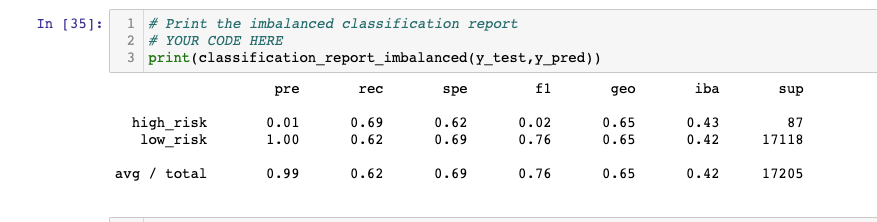

# Credit Risk Analysis

## Overview 

- Analyzing credit risk is a challenging task for machine learning because good loans outnumber risky loans, creating unbalanced classes. 

- This analysis tests a variety of algorithms from `imbalanced-learrn` and `scikit-learn` to determine the best model for predicting high-risk loans. 

- This analysis builds and evaluates the following algorithms: 
    1. `RandomOverSampler`
    2. `SMOTE`
    3. Undersampling with `ClusterCentroids`
    4. Combinatorial sampling with `SMOTEEN`
    5. `BalancedForestClassifier`
    6. `EasyEnsembleClassifier`

## Results

### `RandomOverSampler`

- With random oversampling, the algorithm randomly selects more data points from the minorty class for training the model such that the imbalanced classes are now equal. 

- With this analysis, the `RandomOverSampler` did not produce a helpful model:
    - Model had a 64.6% balanced accuracy schore
    - Precision for predicting high-risk loans was 1% with a recall of 61%

### `SMOTE`

- Synthetic Minority Oversampling Technique increases the size of the minority class through interpolation based on relation of the neighboring data points instead of randomly selecting existing data points of the minority class.

- The `SMOTE` model produced the following results:
    - Balanced accuracy score of 62.3%
    - Precision for predicting high-risk loans was 1% with a recall of 61%

### `ClusterCentroid`

- Undersampling attempts to mitigate the imbalance by decreasing the majority class.
- The `ClusterCentroid` algorithm accomplishes this task by identifying clusters of the majority class and synthetically generating data centroids. 

- In this analysis the `ClusterCentroid` model produced the following results:
    - Balanced accuracy score of 51.9%
    - Precision of predicting high-risk loans was 1% with a recall of 61%.

### `SMOTEEN`

- `SMOTEEN` is a combination of SMOTE and Edited Nearest Neighbors:
    - The algorithm first oversamples the minority class with SMOTE
    - Resulting data is then cleaned with undersampling
        - If 2 nearest neighbors of a given data point belong to 2 different classes, the data point is dropped.

- The `SMOTEEN` model produced the following results:
    -  Balanced accuracy score of 65.3%
    - Precision of predicting high-risk loans of 1% with a recall of 69%.

### `BalancedRandomForestClassifier`

- A random forest classifier is an example of ensemble learning: 
    - The algorithm builds several small decision trees
    - These small decision trees are considered weak learners, but when they are combined they can create a stronger model. 
    - Random forests can protect overfitting, rank importance of input variables, and resist issues caused by outliers and nonlinear data.

- The `BalancedRandomForestClassifier` model produced the following results:
    - Balanced accuracy score of 78.8%
    - Precision of predicting high-risk loans was 4% with a Recall of 67%. 

### `EasyEnsembleClassifier`

- In boosing algorithms, weak learners are used sequentially as one model learns from the mistakes of the previous model.
- Adaptive boosting trains and evaluates a model such that errors are evaluated, then trains another model giving more weight to the errors. 
    - This process minimizes similar errors in the next model. 

- The `EasyEnsembleClassifier` produced the following results:
    - Balanced accuracy score of 92.5% 
    - The precision for predicting high-risk loans was 7% with a recall of 91%.

## Summary

- Building and evaluating these 6 models reveals that the resampling models did not perform adequately for predicting high-risk loans as they all produced low balanaced accuracy scores, precision, and recall. 
- The ensemble algorithms produced more promising results with the Adaptive Boost `EasyEnsembleClassifier` algorithm performing the best with a 92.5% balanced accuracy score and 91% recall. 
- In an analysis that seeks to predict high-risk credit loans, having a model with a higher sensitivity is more beneficial because it is more likely to capture the high-risk loans. 
- Conversely, a model with high precision rate could hide its inadequacy in capturing the desired data.
